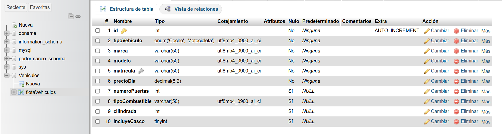

Proyecto: Sistema de Gestión de Flota de Vehículos Objetivo General: 

Desarrollar una aplicación web para una empresa de alquiler de vehículos. 
El sistema permitirá al personal gestionar la flota disponible utilizando PHP bajo el patrón MVC, 
conectándose a MySQL mediante PDO y aplicando la herencia de clases para diferenciar los tipos de vehículos.

Requisitos Técnicos Obligatorios

1. Arquitectura MVC: Separación estricta entre la lógica de acceso a datos(Modelos), 
   la interfaz de usuario (Vistas) y el enrutamiento/lógica de aplicación(Controladores).

1. Base de Datos (MySQL + PDO): Uso exclusivo de la extensión PDO para la conexión.
   Es obligatorio usar sentencias preparadas para evitar inyecciones SQL en todo el CRUD.

2. Programación Orientada a Objetos (Herencia):
    o Clase padre (genérica): Vehiculo.
    o Clases hijas: Coche y Motocicleta.

Estructura de Clases Requerida

• Clase Base Vehiculo:

    o Atributos (protected): id, marca, modelo, matricula, precioDia.

    o Métodos: Constructor, getters, setters y un método calcularAlquiler($dias) 
        que devuelva el coste base multiplicando los días por el precio.

• Clase Hija Coche (Hereda de Vehiculo):

    o Atributos específicos: numeroPuertas, tipoCombustible (diésel,gasolina, eléctrico, híbrido).
    
    o Métodos: Sobrescribir calcularAlquiler($dias) para aplicar, por ejemplo, un recargo del 5% 
        al coste base si es un coche eléctrico (por temas de carga).

• Clase Hija Motocicleta (Hereda de Vehiculo):

    o Atributos específicos: cilindrada (ej. 125cc,500cc), incluyeCasco (booleano).

    o Métodos: Sobrescribir calcularAlquiler($dias) 
        para añadir un extra fijo (ej. 10€) si la moto incluye casco.

Funcionalidades del Sistema (CRUD)

   1. Listar Flota: Un panel principal que muestre el inventario completo de
   vehículos. Debe haber una columna que indique si es un Coche o una Moto, y
   mostrar sus características específicas.

   2. Dar de Alta: Un formulario para añadir un nuevo vehículo. Al seleccionar el
   tipo (Coche o Moto) mediante un selector.

   3. Editar Vehículo: Modificar los datos (precio, modelo, o características
   específicas) de un vehículo ya registrado.

   4. Baja de Vehículo: Eliminar un registro de la base de datos de forma segura.

Esquema de Base de Datos Sugerido

    Para manejar la persistencia de datos manteniendo las cosas simples con PDO, 
    utilizaremos el patrón de "Tabla Única" (Single Table Inheritance):

• Tabla flotaVehiculos:

    o id (INT, Primary Key, Auto Increment)
    o tipoVehiculo (ENUM('Coche', 'Motocicleta')) -> Vital para saber qué clase instanciar al hacer un SELECT. 
        Contendrá o 'Coche' o 'Motocicleta'.
    o marca (VARCHAR)
    o modelo (VARCHAR)
    o matricula (VARCHAR, Unique)
    o precioDia (DECIMAL)
    o numeroPuertas (INT, Nullable)
    o tipoCombustible (VARCHAR, Nullable)
    o cilindrada (INT, Nullable)
    o incluyeCasco (TINYINT/BOOLEAN, Nullable)

Codigo SQL para crear la BD

CREATE TABLE `Vehiculos`.`flotaVehiculos` 
    (`id` INT NOT NULL AUTO_INCREMENT , 
    `tipoVehiculo` ENUM('Coche','Motocicleta') NOT NULL , 
    `marca` VARCHAR(50) NOT NULL , 
    `modelo` VARCHAR(50) NOT NULL , 
    `matricula` VARCHAR(50) NOT NULL , 
    `precioDia` DECIMAL(8,2) NOT NULL , 
    `numeroPuertas` INT NULL DEFAULT NULL , 
    `tipoCombustible` VARCHAR(50) NULL DEFAULT NULL , 
    `cilindrada` INT NULL DEFAULT NULL , 
    `incluyeCasco` TINYINT NULL DEFAULT NULL , 
    PRIMARY KEY (`id`), UNIQUE (`matricula`))
 ENGINE = InnoDB;

 Imagen Correspondiente a la BD
 